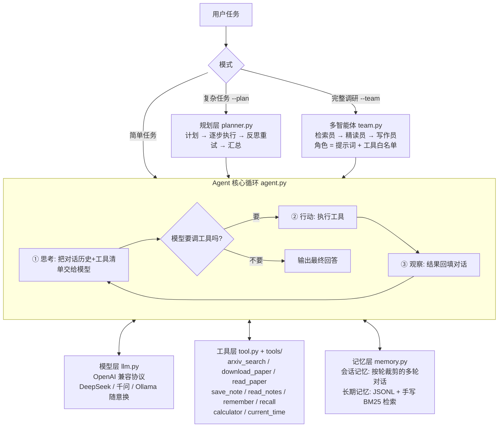
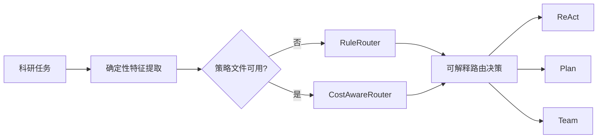

# ScholarAgent —— 面向科研文献调研的自主智能体系统

> 面向科研文献调研的开源 **Agent 工程的透明实验台**：不仅展示最终回答，
> 还保留执行路径、模式差异、质量评分、耗时与调用成本，便于复现和比较。

ScholarAgent 从零实现轻量 Agent 框架，不依赖 LangChain 等编排封装。它能够
**自主规划步骤、调用工具完成文献调研任务**，并提供长期记忆、多角色协作、
本地模型和离线评测能力。项目不把“能对话”当作完成，而是把可运行、可测试、
可解释和诚实披露实验边界放在同一层。

## 当前证据与边界

- 仓库包含 **200+ 项离线测试**，覆盖 Agent 循环、工具、记忆、规划、团队模式、
  路由、指标、启动脚本和本地工作台；可用 `python -m pytest -q` 复验。
- 离线测试证明的是工程行为和回归边界，不等于真实文献任务的答案质量已经达到
  某个固定准确率。
- 路由器、校准脚本、训练脚本和留出集评测入口已经实现。规则路由可在固定 36 题上
  零模型调用地复验复杂度标签一致性；另有 29/54 条真实校准观测用于成本诊断。
  完整校准评分、学习策略和留出集报告仍待完成，**尚未产出正式成本对比结论**。
- 已公开第一个可复验真实案例：ReAct 论文文献调研在 ReAct/Plan/Team 三模式下的
  真实运行（回答、轨迹摘要、指标与初步评分），见
  [`docs/case-study.md`](docs/case-study.md) 与
  `evals/case_results/react-method-evidence-v1/`。该案例评分为作者初步自评，
  独立人工评分与正式成本对比结论仍待完成。
- `data/` 与 `evals/results/` 是本地运行产物，不进入仓库；公开案例会单独提供经过
  检查的输入、轨迹摘要和结果。

本项目还吸收了 [nature-skills](https://github.com/Yuan1z0825/nature-skills)
中“短路由器 + 静态工作流清单 + 来源锚点 + 确定性审查”的可复验思路，
但没有复制其源码、资源或整套技能目录。具体边界和 Apache-2.0 使用注意事项见
[`docs/architecture/nature-skills-吸收说明.md`](docs/architecture/nature-skills-吸收说明.md)。

扫描版 PDF 的阅读增强见
[`docs/architecture/ocr-增强说明.md`](docs/architecture/ocr-增强说明.md)：
项目会优先读取 PDF 文字层；页面没有文字层时，自动尝试调用本机的
Tesseract + `pdftoppm`，并在阅读结果中标记 `[OCR]`，同时把该页证据锚点降为
`medium` 置信度。OCR 是可选外部依赖，不会把用户机器上的二进制文件打进仓库。

网页工作台顶部提供模型选择器：它会发现本机 Ollama 的聊天模型，也会显示 `.env`
中配置的云端 OpenAI 兼容模型。切换只影响之后创建的新任务，正在运行的任务继续使用
启动时已经绑定的模型。运行结果会展示 LLM 调用次数、工具调用次数以及服务实际返回的
输入/输出/总 token；接口没有返回 token 时显示“Token 未返回”，不做估算。配置说明见
[`docs/architecture/模型切换与token统计.md`](docs/architecture/模型切换与token统计.md)。
工作台默认还提供“双模型分工”：云端模型负责外部论文检索和工具决策，本地 Ollama
负责证据摘要、反思和最终汇总；每次运行的事件时间线会显示实际角色与模型。可在页面
一键切回单模型，详细边界见
[`docs/architecture/模型分工与超时策略.md`](docs/architecture/模型分工与超时策略.md)。

## 五分钟启动（源码与安装两条路径）

源码运行适合开发和复验：

```powershell
python -m venv .venv
.venv\Scripts\python -m pip install -r requirements.txt
.venv\Scripts\python main.py --demo
.venv\Scripts\python webapp.py --open
```

安装候选版本适合验证入口和 wheel：

```powershell
.venv\Scripts\python -m pip install ".[dev]"
.venv\Scripts\scholaragent.exe --demo
.venv\Scripts\scholaragent-web.exe --open
```

`--demo` 使用内置脚本模型，不需要 API Key；真实调研仍需在本地 `.env` 配置
OpenAI 兼容接口或运行 Ollama。当前发布候选为 `v0.1.0-rc1`，尚未发布到 PyPI。

## 项目定位

ScholarAgent 不是一个只把问题转发给大模型的聊天壳,而是一个面向
**科研文献调研流程**的可解释 Agent 原型:把大语言模型放进受控的工具链、
记忆、规划和多角色协作框架中,让它能够按步骤完成「检索论文 → 下载阅读
→ 记录结论 → 回忆已有发现 → 汇总回答」这一类任务。

答辩时可以用一句话概括:

> 本项目从零实现了一个轻量级科研调研智能体框架,使大语言模型能够在
> 工具白名单、步数上限和可复现评测约束下,通过 ReAct 循环、任务规划、
> 长期记忆和多智能体流水线辅助完成文献调研。

## 与同类工具的差异

下表只陈述可在本仓库复验的事实，不声明性能领先：

| 维度 | 单模型聊天壳 | 黑盒编排框架 | ScholarAgent |
|---|---|---|---|
| 执行模式选择 | 无模式概念，链路由人工拆 | 通常由开发者硬编码调用链 | ReAct/Plan/Team 三模式 + `--auto` 自动路由，决策附带特征与人话理由 |
| 路由可解释性 | 不适用 | 视框架，多为隐式 | 规则路由零模型调用、版本化特征，固定 36 题标签一致性可复验 |
| 成本感知 | 无 | 少数提供 token 统计 | reward 显式建模质量−延迟−调用−token；token 缺失拒绝观测而非估算 |
| 执行过程可见性 | 只见最终回答 | 见中间消息 | 执行级指标（耗时/LLM 调用/工具调用/token）+ 轨迹 + 产物收集 |
| 失败处理 | 报错即止或静默 | 异常吞掉或回调 | 失败如实保留：步数耗尽、工具错误回传模型纠错、策略损坏安全回退 |
| 依赖重量 | 极轻但无工具链 | 框架级依赖 | 4 个运行时依赖；ReAct 核心循环约 200 行，从零实现 |
| 证据可复验 | 不可 | 视实现 | 案例证据包 + 200+ 项离线测试 + 双系统 CI |

### 五个技术点与复验入口

1. **从零实现的轻量 Agent 循环**：不依赖 LangChain 等编排封装，
   「思考→行动→观察」循环含步数保险丝与坏参数容错。
   复验：`scholaragent/agent.py`；`python main.py --demo`（离线）。
2. **可解释的三模式路由**：确定性特征 `task-features-v1` + 规则基线
   `rule-router-v1` + 可安全回退的学习路由，决策输出特征、理由与策略版本。
   复验：`scholaragent/routing.py`；
   `python evals/evaluate_rule_router.py --tasks evals/router_tasks.jsonl`（零模型调用）。
3. **执行级指标与产物追踪**：每次运行记录真实 LLM/工具调用、token 与耗时，
   并收集论文、笔记、记忆产物；token 为 `None` 时绝不伪造。
   复验：`scholaragent/metrics.py`、`scholaragent/artifacts.py`；
   工作台 Auto 模式运行后的指标面板。
4. **失败可见与安全回退**：案例中 ReAct 模式 15 步耗尽未产出回答被完整保留；
   路由策略缺失/损坏时打印原因并回退规则路由。
   复验：`docs/case-study.md` 第 3 节 react 行；`tests/test_cost_aware_routing.py`。
5. **来源感知与产物审计**：按任务意图和输入来源选择声明式工作流；论文阅读工具
   输出稳定的页码/段落锚点，运行结果和证据包可离线检查 `run_id`、唯一终态事件
   与证据校验状态。
   复验：`scholaragent/workflows/manifests.json`、`scholaragent/evidence.py`、
   `scholaragent/audit.py`；`python -m pytest tests/test_workflow_contracts.py tests/test_artifact_audit.py -q`。

## 核心理念

1. **大模型负责决策,程序负责执行边界**:模型只生成工具名和参数,真正的
   搜索、下载、阅读、计算、记忆写入都由 Python 工具完成;工具错误以文字
   回传给模型纠错,而不是让程序直接崩溃。
2. **复杂任务要分层完成**:简单任务直接走 ReAct 循环,复杂任务先规划再
   执行并反思,完整调研任务交给检索员、精读员、写作员三角色流水线。
3. **结果要能沉淀、能复验**:研究笔记和长期记忆落到本地文件,评测任务集和
   报告用于比较不同模式的质量与耗时,避免只靠主观演示评价系统。

## 能干什么

- 按关键词检索 arXiv 论文,在官方接口繁忙时可用 OpenAlex 的 arXiv 索引兜底。
- 按 arXiv 编号下载 PDF,并按页/字符分段阅读长论文,避免一次塞爆上下文。
- 读取扫描版 PDF：没有文字层的页面会自动尝试 Tesseract OCR，结果带 `[OCR]`
  标记和可审计的页码来源锚点；依赖不可用时会保留可解释的降级信息。
- 保存和读取研究笔记,把重要结论写入长期记忆,再用手写 BM25 检索召回。
- 调用计算器和时钟等基础工具,演示模型如何把外部结果纳入回答。
- 在 `--plan` 模式下执行「计划 → 单步 ReAct 执行 → 反思重试 → 汇总」。
- 在 `--team` 模式下执行「检索员 → 精读员 → 写作员」的多智能体流水线。
- 自动探测本机 Ollama 聊天模型，并在网页工作台切换本地模型或已配置的云端模型。
- 对明确的资料缺口任务自动拆成推理、工具使用、近期综述、推理效率四个方向，
  快捷入口默认先做摘要级快速筛选，也可切换到深度精读；每个方向要求论文核心卡片
  和来源证据，再汇总横向对比与剩余缺口。网页提供“快速/深度补齐四项缺口”快捷入口，
  详见 [`docs/architecture/资料缺口调研说明.md`](docs/architecture/资料缺口调研说明.md)。
- 用 `ScriptedLLM` 离线演示/测试 Agent 循环,用 `evals/` 做模式消融评测。

更完整的毕业设计表述、答辩 demo 脚本和边界说明见
[`docs/核心理念与能力说明.md`](docs/核心理念与能力说明.md)。

## 系统架构



## 目录结构

```
ScholarAgent/
├── main.py                  入口:交互模式 / 单次任务 / --plan / --team / --auto / --demo
├── webapp.py                本地工作台服务(纯标准库 http.server,127.0.0.1:8765)
├── web/                     工作台前端(原生 JS:任务提交、轨迹、指标、产物查看)
├── scholaragent/            核心包(自底向上分层)
│   ├── config.py            配置层:从 .env 读取 API Key 等
│   ├── llm.py               模型层:唯一碰大模型 API 的地方(含测试用假模型)
│   ├── tool.py              工具层:Tool 基类 + ToolRegistry 登记处
│   ├── workspace.py         运行级工作区:论文/笔记/记忆/证据路径
│   ├── events.py            运行事件与取消上下文
│   ├── runtime.py           CLI/Web/评测共用的统一组装与 RunResult
│   ├── workflow.py          静态工作流清单与来源格式路由
│   ├── evidence.py          来源锚点、主张—证据关系与证据账本
│   ├── audit.py             运行结果与证据包的确定性审计
│   ├── ocr.py               Tesseract + PDF 栅格化 OCR 适配器(可选)
│   ├── experiments.py       实验清单与不可覆盖证据包
│   ├── agent.py             智能体层:思考→行动→观察 的 ReAct 循环
│   ├── memory.py            记忆层:会话记忆(按轮裁剪)+
│   │                        长期记忆(JSONL 持久化 + 手写 BM25 检索)
│   ├── planner.py           规划层:计划→执行→反思→汇总(M3)
│   ├── team.py              多智能体:检索员→精读员→写作员流水线(M4)
│   ├── routing.py           路由层:特征提取 + 规则路由 + 成本感知路由(--auto)
│   ├── router_training.py   离线岭回归奖励模型拟合(训练不调用模型)
│   ├── routing_evaluation.py 路由实验汇总:质量加权与混淆矩阵
│   ├── evaluate.py          评测层:任务集加载、关键词打分、报告生成(M6)
│   ├── metrics.py           执行级指标:耗时/LLM 调用/工具调用/token 采集
│   ├── artifacts.py         产物收集:论文、笔记、记忆按运行归档
│   ├── case_study.py        固定案例运行与可公开证据包写出
│   └── tools/               内置工具:arXiv 搜索、论文下载/分段阅读、
│                            研究笔记、记忆存取、计算器、时钟
├── evals/                   评测任务集(tasks.jsonl / router_tasks.jsonl)
│                            与评测入口:run_eval / run_case_study
│                            / evaluate_rule_router / calibrate_router
│                            / train_router / run_routing_eval
├── finetune/                (可选实验)QLoRA 微调脚手架,见其 README
├── tests/                   离线测试,不联网不花钱(核心循环、文献工具、
│                            记忆、规划、多智能体、路由、发布闸门等)
├── data/                    运行时生成:下载的论文 PDF、研究笔记、长期记忆
│                            (已被 .gitignore 忽略,不入库)
├── requirements.txt         依赖清单
└── .env.example             配置模板(复制成 .env 后填 Key)
```

## 快速开始

> **五分钟看懂项目**：评审/演示的完整黄金路径（含离线兜底）见
> [`docs/demo-guide.md`](docs/demo-guide.md)；下面是逐条命令版。

以下命令在 **PowerShell**(Windows 自带终端)中执行:

```powershell
# 1. 创建虚拟环境并安装依赖(只需一次)
python -m venv .venv
.venv\Scripts\python -m pip install -r requirements.txt

# 2. 先跑离线演示,看懂 Agent 循环(不需要 API Key)
.venv\Scripts\python main.py --demo

# 3. 复制配置模板,然后用记事本打开 .env 填入 API Key(保存时保持 UTF-8 编码)
Copy-Item .env.example .env

# 4. 和真模型对话(装了 Ollama 的机器可跳过第 3 步,会自动用本地模型)
.venv\Scripts\python main.py "现在几点了?顺便帮我算 365*24"

# 5. 复杂任务用规划模式,完整调研用团队模式
.venv\Scripts\python main.py --plan "调研 ReAct 论文的核心思想并记笔记"
.venv\Scripts\python main.py --team "LLM agent 的记忆机制"

# 6. 跑测试 / 跑评测
.venv\Scripts\python -m pytest tests -q
.venv\Scripts\python evals/run_eval.py --mode react --limit 4
```

> **为什么用 `.venv\Scripts\python` 而不是"激活虚拟环境"**:免激活写法在
> PowerShell/cmd 里都能直接跑,不受 PowerShell 执行策略限制,电脑上装了
> 多个 Python 也绝不会用错解释器,对初学者最稳。
>
> 如果你更喜欢激活的方式:PowerShell 执行 `.venv\Scripts\Activate.ps1`
> (若提示"禁止运行脚本",先执行一次
> `Set-ExecutionPolicy -Scope CurrentUser RemoteSigned`);
> cmd 执行 `.venv\Scripts\activate.bat`;Git Bash 执行
> `source .venv/Scripts/activate`。注意:**每开一个新终端都要重新激活**,
> 只有第 1 步的创建和安装是一次性的。
> cmd 用户把第 3 步换成 `copy .env.example .env`。

## 开发路线图

| 阶段 | 内容 | 状态 |
|------|------|------|
| M0 | 核心框架:模型层 + 工具层 + ReAct 循环 + 测试 | ✅ 已完成 |
| M1 | 文献工具集:arXiv 搜索、PDF 下载与分段阅读、研究笔记 | ✅ 已完成 |
| M2 | 记忆系统:多轮对话记忆 + 长期记忆(BM25 检索,预留向量接口) | ✅ 已完成 |
| M3 | 规划能力:复杂任务分解、计划—执行—反思(`--plan`) | ✅ 已完成 |
| M4 | 多智能体:检索员 / 精读员 / 写作员分工协作(`--team`) | ✅ 已完成 |
| M5 | 本地模型:无 Key 自动使用本机 Ollama,全流程已实测;QLoRA 微调脚手架就绪(实际训练待启动,见 finetune/) | ✅ 基础完成 |
| M6 | 评测:任务集 + 三模式消融框架已就绪(完整实验与论文数据待跑) | ✅ 框架完成 |

> 硬件说明:RTX 4060 8G 可跑 7B 模型的 int4 量化推理,
> 以及 1.5B~3B 模型的 QLoRA 微调,M5 阶段够用。

## 设计原则

1. **分层单向依赖**:上层只依赖下层接口,换模型/加工具不动核心代码。
2. **错误回传而非崩溃**:工具出错的信息交还给模型,让它自己纠错重试。
3. **一切可离线验证**:假模型 ScriptedLLM 让测试和演示零成本。

## 成本感知自适应路由

`--auto` 是显式启用的第四种入口，不会改变默认 ReAct、`--plan` 或 `--team`
的行为。它先从任务文字提取版本化的本地特征，再在三种执行模式间选择：



特征包括任务长度、行动目标数、文献检索、全文阅读、多论文比较、综述、记忆
和约束依赖，以及偏置项。训练和推理固定使用 `task-features-v1` 的名称和顺序。
规则路由用于冷启动；学习路由对每个模式拟合离线岭回归奖励模型：

```text
reward = quality
         - lambda_time  * normalized_latency
         - lambda_calls * normalized_llm_calls
         - lambda_token * normalized_tokens
```

API 未返回 token 时指标为 `None`。当 `lambda_token` 非零，训练会拒绝这类
观测，不会估算 token。策略缺失、损坏或特征版本不匹配时，`--auto` 会打印原因并
安全回退到 `RuleRouter`。

```powershell
# 自动路由；没有 data/router/policy.json 时使用规则路由
.venv\Scripts\python main.py --auto "检索并阅读全文，比较三篇论文，撰写研究脉络综述"

# 零模型调用评估规则路由
.venv\Scripts\python evals\evaluate_rule_router.py --tasks evals\router_tasks.jsonl --output-dir evals\results\rule_routing

# 先在固定校准集上运行三种模式，原始文件不得覆盖
.venv\Scripts\python evals\calibrate_router.py --output evals\results\router_calibration.jsonl

# 人工完成独立评分表后训练策略；训练不会调用模型
.venv\Scripts\python evals\train_router.py --observations evals\results\router_calibration.jsonl --scores evals\results\router_scores.jsonl

# 留出集正式比较：五种策略、两项主消融和可选成本敏感性策略
.venv\Scripts\python evals\run_routing_eval.py --policy data\router\policy.json --quality-only-policy data\router\policy_quality_only.json --global-policy data\router\policy_global.json --sensitivity-policy low_time=data\router\policy_low_time.json --sensitivity-policy high_time=data\router\policy_high_time.json
```

正式报告同时保留 JSONL 原始回答、质量、耗时、LLM/工具调用、token、路由混淆矩阵
和每题理由。质量由独立人工评分表按任务完成、事实正确性、引用有效性和输出完整性
加权；未评分数据会明确标记为“未评分”，不纳入质量结论。

实验清单也可以生成不可覆盖的证据包与 Markdown 汇总；下面是完全离线的示例：

```powershell
.venv\Scripts\python evals\run_experiment.py `
  --manifest evals\experiments\offline_demo.json `
  --output evals\results\offline-demo-v1
```

清单运行会把公开证据与 `<output>.state` 私有工作区分开；目标目录已存在时拒绝重跑覆盖。

## 上下文成本控制

Agent 循环每一步都会把完整对话历史重发给模型。一次 `read_paper` 返回约 6000
字符的论文原文,若 8 次读完全文,旧片段会在后续每一步被整段重复计费——这是
长任务 prompt token 的最大浪费。

ScholarAgent 在发送前自动压缩较早的工具结果:最近 2 条保持原文(模型正要用
它继续阅读),更早的压到约 600 字符(保头保尾,页码标记和结论位置都在),并
打上标记告知模型原文可重新调用工具获取。消息只改内容、不删不重排,工具调用
配对保持完整;压缩时打印透明日志(`[上下文] 已压缩 N 条…`),写回会话记忆的
也是压缩后历史。三种执行模式(ReAct/Plan/Team)自动同时受益。

离线实测(`tests/test_context_compression.py`,9 步读论文任务):压缩开启后
模型收到的总字符量降至关闭时的 50% 以下;真实 token 节省幅度取决于任务中
长观察的占比,读论文类任务受益最大。可通过环境变量调整或关闭:

```text
AGENT_CONTEXT_RECENT_OBSERVATIONS=2     # 最近几条工具结果保持原文
AGENT_CONTEXT_OLD_OBSERVATION_CHARS=600 # 更早的压到多少字符;0=关闭
```

## 本地工作台

本地工作台把现有执行器接到浏览器，不会把 API Key 发送给前端，也不会监听局域网。

**一键启动（推荐）**：在资源管理器中双击项目根目录的 `start.bat`
（或在 PowerShell 中执行 `.\start.ps1`）。脚本会自动：

1. 若无 `.venv` 则创建并安装 `requirements.txt`
2. 若无 `.env` 则从 `.env.example` 复制一份
3. 启动工作台并打开浏览器 `http://127.0.0.1:8765`

也可手动启动：

```powershell
.venv\Scripts\python webapp.py --open
```

页面可选择 ReAct、Plan、Team、Auto；Auto 会显示实际选择的模式、策略版本、理由与耗时。
默认任务分工是“云端检索 · 本地总结”；模型分工和单模型都只影响新任务。后台任务的
900 秒是协作式软超时，不是硬杀限制，可通过 `SCHOLARAGENT_JOB_SOFT_TIMEOUT_SECONDS`
调整。按 `Ctrl+C` 停止本地服务。

## 开源治理

- 许可证：[MIT License](LICENSE)
- 贡献流程：[CONTRIBUTING.md](CONTRIBUTING.md)
- 安全报告：[SECURITY.md](SECURITY.md)
- 行为准则：[CODE_OF_CONDUCT.md](CODE_OF_CONDUCT.md)
- 更新日志：[CHANGELOG.md](CHANGELOG.md)
- 维护说明：[MAINTAINERS.md](MAINTAINERS.md)
- 发展路线：[docs/ROADMAP.md](docs/ROADMAP.md)

运行时依赖（openai、python-dotenv、httpx、pypdf）均为 MIT 或 Apache-2.0
许可证，与本项目 MIT 许可证兼容；Issue / PR 模板与离线测试 CI 位于
`.github/`。

欢迎通过 Issue 提交可复现的问题或使用场景；代码修改请附测试命令和结果。
