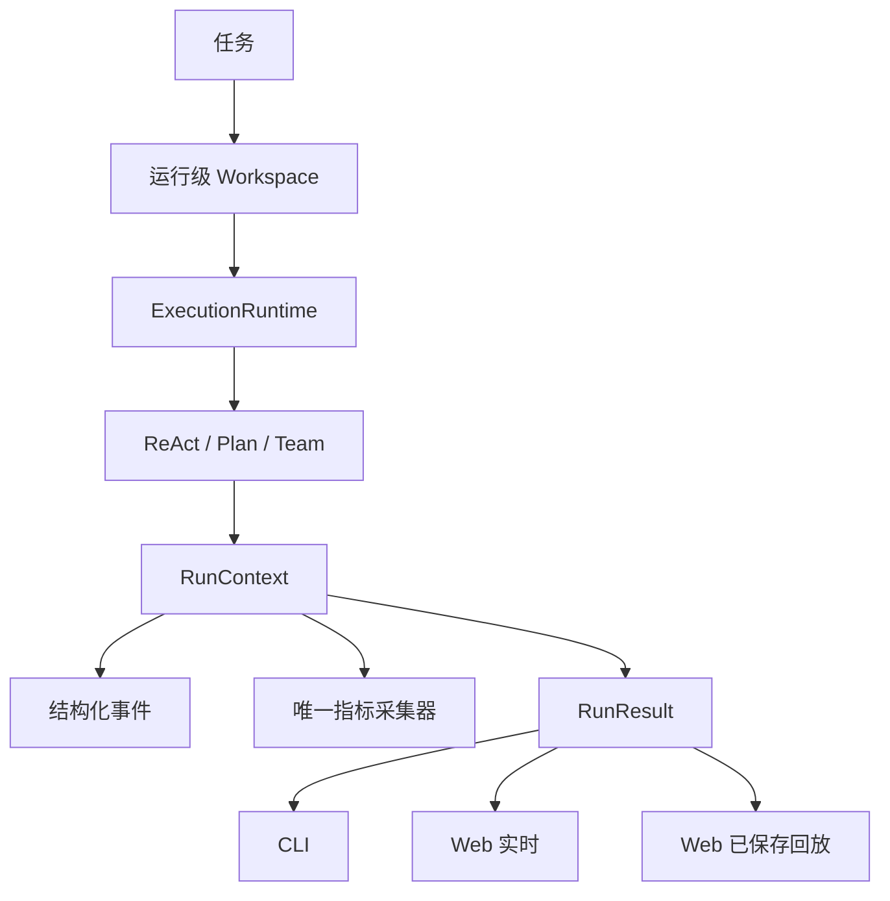
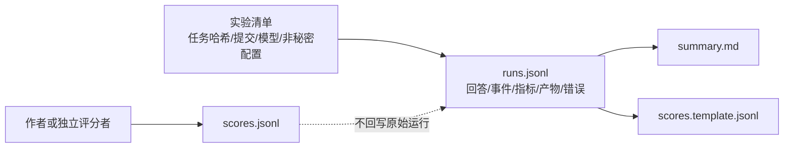

# 答辩图表源稿

以下图表只使用仓库已有事实；真实模型新增数据必须先进入不可覆盖证据包，再更新图表。

## 图一：统一运行时流程

## 图二：证据链

## 图三：已公开案例的诚实展示

| 内容 | 可展示证据 | 口径 |
|---|---|---|
| 三模式行为差异 | [`docs/case-study.md`](../case-study.md) | 单个 ReAct 论文案例，不推广为普遍性能 |
| 失败保留 | `react` 运行的步数耗尽记录 | 失败是证据，不重跑美化 |
| 规则路由 | [`evals/router_tasks.jsonl`](../../evals/router_tasks.jsonl) 与规则评测命令 | 标签一致性，不是回答质量 |
| 未完成项目 | [`docs/contest/证据矩阵.md`](证据矩阵.md) | 明确标记待补数据 |
