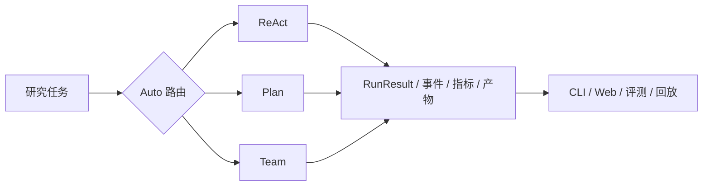

# ScholarAgent 项目介绍源稿

> 这是项目介绍的 Markdown/PDF 源稿。导出 PDF 前只替换“现场记录”占位符，所有
> 工程数字都回链到仓库文件；本稿不代表已完成外部发布。

## 项目定位

ScholarAgent 是面向科研文献调研的透明智能体实验台：把模型选择、工具调用、
执行事件、指标、论文/笔记/记忆产物和失败状态放到同一次运行的证据链中。核心框架
不依赖 LangChain 等编排封装，采用 OpenAI 兼容接口或本机 Ollama。

## 技术路径

- ReAct、Plan、Team 三种模式由 [`scholaragent/runtime.py`](../../scholaragent/runtime.py)
  统一组装；旧的 `run(task) -> str` 接口仍由适配器保留。
- 工作区、事件和结构化工具结果分别由 [`workspace.py`](../../scholaragent/workspace.py)、
  [`events.py`](../../scholaragent/events.py) 和 [`tool.py`](../../scholaragent/tool.py)
  提供稳定接缝。
- 实验清单记录任务集哈希、Git 提交、模型、非秘密配置、运行时间、事件、指标、产物
  摘要和错误；输出目录存在时拒绝覆盖，见 [`experiments.py`](../../scholaragent/experiments.py)。

## 已有证据与边界

- 离线工程行为由 [`python -m pytest -q`](../../tests/) 复验；README 使用“130+ 项”
  这一保守表述，避免材料间绑定某次本地收集数量。
- 规则路由固定集的 36/36 是与预设复杂度标签的一致性检查，命令见
  [`evals/evaluate_rule_router.py`](../../evals/evaluate_rule_router.py)，不是回答质量。
- ReAct 论文案例的三模式运行、回答、轨迹摘要和作者初步评分见
  [`evals/case_results/react-method-evidence-v1/`](../../evals/case_results/react-method-evidence-v1/)。
- ResNet 案例定义已准备但尚未运行；正式学习路由对比和独立评分没有完成前，不能给出
  成本—质量领先结论。

## 比赛前待填写

| 材料 | 状态 | 来源 |
|---|---|---|
| wheel 安装耗时 | 待现场记录 | [`安装演示记录模板.md`](安装演示记录模板.md) |
| 第二案例运行结果 | 待真实模型运行 | [`evals/cases/resnet_method.json`](../../evals/cases/resnet_method.json) |
| 独立评分 | 待评分者完成 | [`独立评分表模板.md`](独立评分表模板.md) |
| 视频截图/封面图 | 待录制/设计 | [`演示视频分镜稿.md`](演示视频分镜稿.md) |

## PDF 导出建议

使用任意本地 Markdown 编辑器导出，或按团队工具链执行；导出前检查链接、代码字体、
Mermaid 图和“待现场记录”是否仍被误读为已完成数据。不要在未确认前上传或公开发布。
